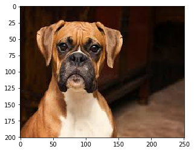
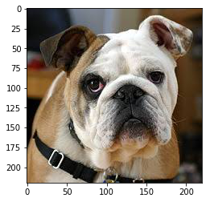
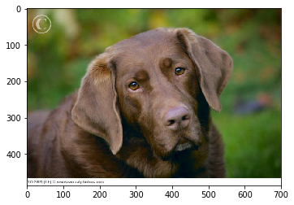
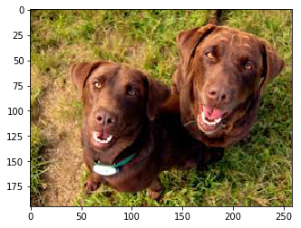
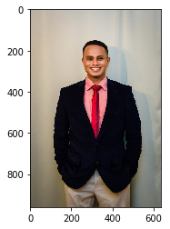
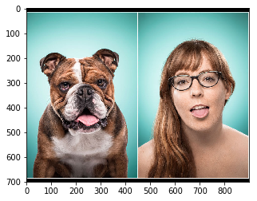
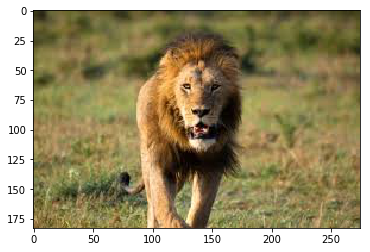

# Dog Breed Classifier (CNN)

An image pipeline that takes a photo, figures out whether it shows a dog or a human, and then predicts the dog breed — or, if it's a human, the dog breed they most resemble. Built with Keras CNNs and transfer learning as the Convolutional Neural Networks project for Udacity's Artificial Intelligence Nanodegree.

<p align="center">
  
</p>

## Contents

- [How it works](#how-it-works)
- [Results](#results)
- [Repository structure](#repository-structure)
- [Setup](#setup)
- [Credits](#credits)

## How it works

The pipeline is three detectors chained together, each solving a different piece of the problem:

**1. Is there a human face?** — OpenCV's Haar cascade classifier (`haarcascades/haarcascade_frontalface_alt.xml`) checks for a human face.

**2. Is there a dog?** — a ResNet-50 pretrained on ImageNet checks whether the top predicted class falls in the "dog" range of ImageNet's 1000 categories.

**3. Which breed?** — if either a dog or a human was found, a CNN predicts which of 133 dog breeds it looks most like. Three CNNs were built and compared, in increasing sophistication:

| Model | Approach | Test accuracy |
|---|---|---|
| From scratch | A small 3-layer CNN trained from random initialization | 4.07% |
| VGG-16 transfer learning | VGG-16 bottleneck features → global average pooling → dense softmax | 41.15% |
| **ResNet-50 transfer learning (final)** | ResNet-50 bottleneck features → global average pooling → dense softmax | **78.47%** |

Going from a from-scratch CNN to transfer learning on bottleneck features from a deeper, ImageNet-pretrained network is what actually makes this work — the rubric only required 1% for the from-scratch model and 60% for the transfer-learning one, and ResNet-50 clears that by a wide margin. Full reasoning for each architecture choice is in the notebook (`dog_app.ipynb`, Questions 4 and 5); short version: more conv/pooling layers alone (from-scratch) helps only a little on 6,680 training images, but reusing features already learned from 1.2M ImageNet images gets most of the way there, and ResNet-50's deeper, residual architecture generalizes better than VGG-16 or VGG-19 did for this dataset.

The from-scratch CNN (3× conv+pool blocks → global average pooling → 133-way softmax, 33,765 parameters) was trained for 10 epochs; the ResNet-50 head (just a global average pooling + dense layer on top of frozen bottleneck features, 272,517 parameters) for 30 epochs with checkpointing on validation loss.

### Detector accuracy

Measured on the first 100 images of each dataset:

| Detector | Correctly detects target | False positives on the other class |
|---|---|---|
| Haar cascade (human face) | 99% of human photos | 11% of dog photos |
| ResNet-50 (dog) | 100% of dog photos | 4% of human photos |

## Results

The full pipeline (`dog_algorithm()` in the notebook) run end-to-end on 7 test photos — a mix of dogs, humans, and neither:

| Input | Prediction |
|---|---|
|  | 🐶 Dog detected — **Boxer** (correct) |
|  | 🐶 Dog detected — **Bulldog** (correct) |
|  | 🐶 Dog detected — **Labrador retriever** (correct) |
|  | 🐶 Dog detected — Chesapeake Bay retriever (two labradors — see note below) |
|  | 🙂 Human detected — resembles a **Black Russian terrier** |
|  | 🙂 Human detected — resembles a Bulldog (photo also contains a dog — see note below) |
|  | ❌ Neither detected (correctly rejected — it's a lion) |

**What worked:** single dog or single human photos are classified correctly, and the lion photo is correctly rejected as neither.

**Where it breaks down**, straight from the project writeup:
1. **Multiple dogs of the same breed in one frame** confuse the breed classifier — it detects "dog" correctly but picks the wrong breed (`Two_chocolate_labrador.jpg`). The pipeline has no multi-object detection, so it's reasoning about the whole image as one subject.
2. **A photo containing both a human and a dog** only reports one of them (`Human_and_Dog.jpg`) — again a consequence of no multi-object detection.
3. Untested but flagged as a likely gap: performance on different human age groups and on puppies, since the model was trained only on adult dog breed photos.

## Repository structure

```
.
├── dog_app.ipynb                  # Main notebook: builds and evaluates the full pipeline
├── report.html                    # Static rendered export of the executed notebook
├── extract_bottleneck_features.py # Helper to compute bottleneck features for a single image at inference time
├── haarcascades/                  # OpenCV Haar cascade XML for human face detection
├── images/                        # Diagrams and example photos used to explain the project (see notebook)
├── test_images/                   # Author's own photos used to test the final pipeline
├── results/
│   └── algorithm_test_samples/    # The actual images + predictions shown above, pulled from the executed notebook
├── bottleneck_features/           # Empty — populated by downloading bottleneck features (see Setup)
├── saved_models/                  # Empty — populated with trained model weights when you run the notebook
└── requirements/                  # Conda environment files (Mac/Linux/Windows) + pip requirements.txt
```

## Setup

This project needs three things that aren't in the repo (by design — they're too large to commit):

1. **Dog images**: download the [dog dataset](https://s3-us-west-1.amazonaws.com/udacity-aind/dog-project/dogImages.zip), unzip to `dogImages/` at the repo root.
2. **Human images**: download the [human dataset](https://s3-us-west-1.amazonaws.com/udacity-aind/dog-project/lfw.zip), unzip to `lfw/` at the repo root.
3. **Bottleneck features**: download [DogVGG16Data.npz](https://s3-us-west-1.amazonaws.com/udacity-aind/dog-project/DogVGG16Data.npz) and [DogResnet50Data.npz](https://s3-us-west-1.amazonaws.com/udacity-aind/dog-project/DogResnet50Data.npz) into `bottleneck_features/`. The ResNet-50 file is what the final model trains on; `extract_bottleneck_features.py` computes the same features for a single new image at prediction time.

Then install dependencies — pick your platform's conda environment file, or use pip directly:

```bash
# conda (recommended, matches the original environment)
conda env create -f requirements/aind-dog-linux.yml   # or -mac.yml / -windows.yml
conda activate aind-dog

# or plain pip
pip install -r requirements/requirements.txt
```

`requirements/requirements.txt` pins the original 2017-era package versions (Keras 2.0.2, TensorFlow 1.0.0) needed to reproduce the notebook exactly as run. These are long past their security-support window; ask if you'd like them bumped to current versions the way the [time-series RNN project](https://github.com/ShihanUTSA/Time-series-prediction-using-a-Recurrent-Neural-Network) was.

Then open and run `dog_app.ipynb`.

## Credits

Built as the Convolutional Neural Networks project for Udacity's Artificial Intelligence Nanodegree. Course-provided starter code, the Haar cascade file, and the human/dog/bottleneck-feature datasets are credited to Udacity; the CNN architectures, `dog_algorithm()`, and this README's writeup and results are the author's own work.
